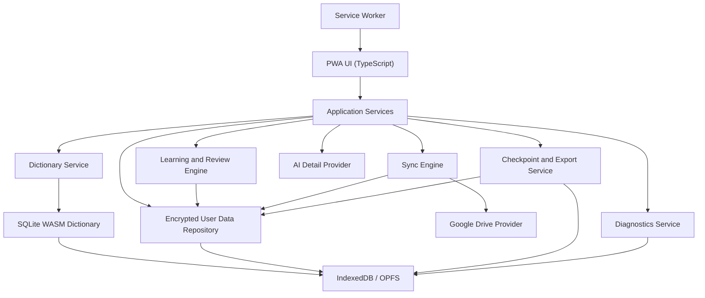

# WordLover Architecture Design

## Goals

WordLover is a local-first vocabulary and dictionary app for iPhone, iPad, Android phones, Android tablets, and Windows PCs. The architecture must satisfy the PRD while keeping the core experience fast, no-fee for personal use, offline-capable, portable, debuggable, and safe for user data.

Core principles:

- Local first: dictionary, vocabulary, review, stats, and learning work offline.
- Personal use must not require app-specific fees, subscriptions, paid app-store purchases, or paid developer account fees.
- The primary install target is a Progressive Web App because it is the safest fit for long-term no-fee iPhone/iPad use.
- User data is separate from dictionary data.
- Every saved item is a `term`, meaning a word or short phrase.
- Every saved term uses a normalized term key for duplicate detection and sync.
- Every meaning preserves its source: ECDICT, WordNet, user edited, or AI assisted.
- Cloud sync is optional and stores a full encrypted copy of user data.
- AI-assisted details are optional online enhancements, never a requirement for core study.

## Platform Strategy

### Primary Stack

Use a PWA-first web architecture.

Recommended stack:

- App framework: React + TypeScript or SvelteKit + TypeScript.
- Build tool: Vite.
- PWA/offline: service worker, web app manifest, Cache Storage, IndexedDB, and Origin Private File System where available.
- Dictionary engine: SQLite compiled to WebAssembly, backed by a local browser file or IndexedDB persistence.
- User data store: encrypted IndexedDB, with a repository abstraction so a future native wrapper can swap the storage backend.
- Search acceleration: prebuilt SQLite indexes plus a compact prefix/FTS search table.
- Sync: Google Drive REST API through OAuth for the first cloud provider.
- AI details: ChatGPT/OpenAI integration through user-connected online flow, isolated from offline core.
- Packaging: web app install to Home Screen/Desktop; optional Android/Windows/native wrappers later.

The PWA must be able to run from the browser and as an installed Home Screen/Desktop app. The same app shell should serve iPhone, iPad, Android, tablet, and Windows users.

### Why PWA First

Native iOS apps have Apple-controlled signing and distribution constraints. A PWA installed through Safari's Add to Home Screen path avoids paid App Store distribution and paid Apple Developer Program dependency for personal long-term use. This makes PWA the preferred architecture for the stated no-fee requirement.

Native wrappers may be added later for Android or Windows convenience, but they must not become required for the core product.

## Distribution and No-Fee Personal Install

The distribution architecture must satisfy the no-fee long-term personal-use requirement:

- iPhone/iPad: install as a Safari Home Screen web app.
- Android: install as a PWA from browser; optionally provide a no-fee sideloadable APK/TWA later.
- Windows: install as a PWA from Edge/Chrome; optionally provide a portable desktop wrapper later.

Distribution requirements:

- The core app must not depend on App Store-only services.
- The app must not require paid Apple Developer Program membership.
- The app must not require TestFlight for long-term use.
- The app must not require a paid app-store purchase or app-specific subscription for core features.
- Local dictionary and user-data features must work in the PWA install channel.
- Sync, export/import, checkpoints, and diagnostics must not assume native app-store identity.
- Install documentation must describe the no-fee path for iPhone/iPad, Android, and Windows.

PWA install documentation should include:

- iPhone/iPad: open app URL in Safari, Share, Add to Home Screen, enable Open as Web App when available.
- Android: open app URL in Chrome/Edge, Install app or Add to Home Screen.
- Windows: open app URL in Edge/Chrome, Install app.

## Browser Capability Requirements

Because the app is PWA-first, implementation must account for browser limitations:

- All core data must be available offline after first successful install/setup.
- The service worker must cache the app shell and static assets.
- Dictionary data must be stored locally outside ordinary HTTP cache when possible, because browser cache can be evicted.
- User data must be encrypted before being stored in IndexedDB.
- The app must detect storage availability and estimate quota before downloading/importing the dictionary.
- The app must show a clear warning if the browser cannot provide enough durable storage for the dictionary.
- Export/import must provide a recovery path if browser storage is cleared.
- Cloud sync remains the main cross-device backup.

Recommended storage layers:

| Data | Storage | Notes |
| --- | --- | --- |
| App shell | Service worker Cache Storage | Small, versioned, replaceable |
| Dictionary package | IndexedDB Blob or OPFS file | Read-only, rebuildable, can be re-downloaded/imported |
| Dictionary indexes | SQLite WASM database or generated search shards | Optimized for under-1-second lookup |
| User data | Encrypted IndexedDB records | Authoritative local user store |
| Checkpoints | Encrypted tar blobs in IndexedDB/OPFS | Also syncable to Google Drive |
| Logs | IndexedDB ring buffer | Redacted bundle export |
| Export files | Browser download / File System Access when available | User-controlled |

## High-Level Architecture



## Major Modules

### PWA Shell

Responsibilities:

- Installable web app manifest with icons, name, theme color, display mode, and start URL.
- Service worker for app shell caching and offline navigation fallback.
- Versioned update flow that can safely migrate user data.
- Home screen with top search input, daily stats, due-review button, and proactive new-word button.
- Dictionary result detail view.
- Vocabulary list, term detail, edit, archive, restore, and search/filter UI.
- Review and quiz flows.
- Fast Encoding Mode.
- AI-assisted detail entry point wherever a term is displayed.
- Settings for autosave, sync, export/import, diagnostics, and privacy deletion.
- Accessibility support for large text and mobile-friendly touch targets.

UI rule:

- Treat all user-entered vocabulary items as `term`, not only `word`.
- Use responsive layouts for phone, tablet, and desktop widths.
- Avoid essential hover-only interactions because iPhone/iPad and Android are touch-first.

### Service Worker

Responsibilities:

- Cache app shell and static assets.
- Serve app offline.
- Manage app version changes.
- Avoid caching user-private export/log files in plain form.
- Never block local dictionary lookup on network.

Service worker caching strategy:

- App shell: cache-first with explicit version.
- API/network requests: network-first where online, graceful offline fallback.
- Dictionary package: do not rely only on HTTP cache; persist through app storage after first setup.

### Dictionary Data Pipeline

Existing local scripts generate `data/dictionary.sqlite` from ECDICT and augment missing definitions from WordNet and OPTED/Webster. For PWA delivery, add a web packaging step.

Recommended web dictionary package:

```text
dictionary/
  dictionary.sqlite.zst or dictionary.sqlite.br
  dictionary-manifest.json
  dictionary-search-prefix.bin or dictionary-search.sqlite
```

Manifest fields:

```json
{
  "dictionaryDataVersion": "2026.05.24",
  "source": ["ECDICT", "WordNet 3.0", "OPTED/Webster 1913"],
  "sqliteSha256": "...",
  "compressedBytes": 0,
  "uncompressedBytes": 0,
  "schemaVersion": "1.0",
  "createdAt": "..."
}
```

Implementation options:

1. SQLite WASM + local DB file.
   - Best fit for current dictionary pipeline.
   - Supports exact lookup, prefix lookup, frequency ordering, and source fields.
   - Needs careful browser persistence setup.

2. Sharded JSON/MessagePack search index + detail blobs.
   - Potentially faster startup and easier streaming.
   - More custom code.

Default recommendation:

- Start with SQLite WASM because the current pipeline already creates SQLite and requirements include rich structured lookup.
- Add a compact prefix index only if SQLite WASM cannot satisfy the 1-second search target on older phones.

### Dictionary Service

Inputs:

- Raw user input.
- Local dictionary package.
- User vocabulary state, to show saved/unsaved/archived state and avoid recommending duplicates.

Responsibilities:

- Normalize terms:
  - trim leading/trailing whitespace
  - collapse repeated spaces
  - normalize apostrophe variants
  - lowercase/casefold for keys
  - allow letters, spaces, hyphens, and apostrophes
  - reject unsupported punctuation and numbers for normal study terms
- Search local dictionary within 1 second.
- Rank matches:
  1. exact normalized match
  2. prefix match
  3. phrase match
  4. fuzzy match from a narrowed candidate set
  5. frequency-ranked fallback
- Return dictionary details:
  - term
  - normalized key
  - English meanings with per-meaning source
  - Chinese meanings with per-meaning source
  - pronunciation marks
  - audio availability
  - frequency metadata
  - dictionary source metadata
  - saved/archived state for this user

Search performance tactics:

- Load dictionary engine lazily but before first user search when possible.
- Keep exact and prefix lookup indexes resident or cheaply accessible.
- Candidate-limit fuzzy search.
- Debounce typing, for example 100-200 ms, while still keeping perceived response under 1 second.
- Run heavier search work in a Web Worker so the UI stays responsive.

### User Data Repository

The user repository owns encrypted user-specific data in browser storage.

Responsibilities:

- Store exactly one vocabulary list per user for now.
- Store settings, stats, search history, review state, checkpoints, diagnostics metadata, sync metadata, and generated learning materials.
- Encrypt records before writing to IndexedDB.
- Provide migration and validation hooks.
- Provide import/export snapshots.

Recommended implementation:

- Use IndexedDB through a typed wrapper such as Dexie.
- Store encrypted JSON/CBOR records.
- Keep lightweight indexes in cleartext only when necessary for local performance and only for low-sensitivity fields. Prefer hashed normalized terms for duplicate checks.
- Use Web Crypto API for encryption.

Suggested encryption:

- AES-GCM for record/package encryption.
- Per-user data encryption key.
- Key stored in browser-accessible secure storage is limited in PWAs; therefore, the design needs an explicit key strategy:
  - Option A: user passphrase-derived key.
  - Option B: cloud-recoverable wrapped key after Google sign-in.
  - Option C: local generated key plus export recovery key.

Open decision: choose the final key recovery strategy before implementing sync.

### Vocabulary Service

Responsibilities:

- Automatically create exactly one vocabulary list per user on first save.
- Save dictionary results manually or through autosave.
- Prevent duplicate active entries by normalized term key.
- Preserve original dictionary data separately from user-edited data.
- Display user-edited values by default.
- Allow editing Chinese meaning, English meaning, and pronunciation.
- Allow archive/hide and restore.
- Exclude archived terms from normal list, review, and proactive study.
- Require at least one meaning to save unknown or incomplete terms.

Saved item rule:

- `VocabularyItem` is the user-owned object.
- `DictionaryEntry` is source data.
- User edits never mutate bundled dictionary data.

### Search and Autosave Service

Responsibilities:

- Show ten most recent valid search history items on search focus.
- Save only resolved dictionary matches to search history.
- Autosave matched dictionary searches when autosave is enabled.
- Never autosave unmatched searches.
- Never autosave duplicates.
- Respect autosave disabled setting.
- Persist autosave setting per user.

Autosave timing:

- Do not save every transient keystroke.
- Autosave only when a matched result is settled, selected, left visible for a defined dwell period, or the user navigates away while a valid result is active.
- The dwell period should be configurable in code and tested; a suggested initial value is 2-3 seconds.

### Learning and Review Engine

Responsibilities:

- Fast Encoding Mode for first-time learning.
- Quiz Mode sequence:
  - multiple choice
  - stepwise multiple choice
  - typed meaning
  - cloze sentence
  - personal sentence creation
- Review Mode using FSRS or equivalent adaptive spaced repetition.
- Difficult Word Mode for failed/repeatedly forgotten terms.
- Proactive new-word study from high-frequency dictionary words not already active or archived.
- Review grade scale from 1 to 5:
  - 1: very new or needs full cycle
  - 2: hard
  - 3: remembered with effort
  - 4: remembered well
  - 5: mastered, no normal scheduled review

Review scheduling:

- Initial schedule supports 10 minutes, same evening, 1 day, 3 days, 7 days, 14 days, and 30 days.
- Adaptive scheduling updates from correctness, first-attempt result, grade, response time, quiz mode, and difficult-word signals.
- Grade 5 marks a term mastered unless later failure or manual grade change lowers it.

Proactive new-word flow:

1. Pick frequent unsaved candidate.
2. Show multiple-choice quiz first.
3. If correct on first attempt, mark as already known and do not add to vocabulary.
4. If incorrect on first attempt, treat the word like a successful dictionary search and apply save/autosave rules.

Implementation notes:

- Run scheduling locally and deterministically.
- Store scheduler state as part of `ReviewState`.
- Store quiz attempts as immutable events so stats and sync are reproducible.

### Stats Service

Responsibilities:

- Calculate today's home dashboard:
  - new terms saved today
  - existing terms reviewed today
  - terms that became solidly remembered today
- Track learning/review outcomes by mode.
- Track difficult terms and mastery promotions.
- Exclude first-attempt-known proactive words from new-saved count.

Stats should be derived from immutable study events where possible, not only mutable counters. This makes sync and rollback safer.

### AI Detail Service

Responsibilities:

- Provide a button wherever a term is displayed.
- Open or use the user's connected ChatGPT-capable account when available.
- Require internet access.
- Keep local dictionary experience fully usable without AI.
- Generate/display:
  - two example sentences per distinct meaning
  - follow-up Q&A
  - quick actions for history/origin, natural usage, most frequent meaning, pronunciation tips, common mistakes, similar-word differences, and phrase usage
- Mark any saved AI content as AI assisted.

PWA implementation options:

- Open a ChatGPT deep link or web flow with prepared context when the user wants to continue in their ChatGPT account.
- Or use an OpenAI API-compatible provider if the user configures credentials. This must remain optional.

AI data rule:

- AI content is supplemental.
- It must not overwrite dictionary or user-edited data unless the user explicitly copies/saves it.
- Previously generated AI content may be stored locally for offline reuse if the user saves it.

### Sync Engine

Responsibilities:

- Optional cloud sync; app remains fully usable without sign-in or internet.
- Google Drive is the first cloud provider.
- Sync full encrypted user-data copy plus metadata, not only incremental changes.
- Queue offline changes and upload later.
- Show sync status: synced, pending, failed, offline.
- Merge user data across devices.
- Never silently delete user-created content.
- Preserve user-edited meanings and pronunciation on conflict.

Cloud layout:

```text
WordLover/
  user-data-current.tar.enc
  user-data-current.manifest.json
  checkpoints/
    checkpoint-YYYYMMDD-HHMMSS.tar.enc
  diagnostics/
    log-bundle-YYYYMMDD-HHMMSS.tar.gz
```

The exact Drive folder may use app-specific storage, but the logical layout should remain provider-independent.

Sync strategy:

- Local user data is authoritative while offline.
- Each local write records an event with a monotonically increasing local sequence number.
- Sync uploads a full encrypted snapshot and a manifest after successful local validation.
- Sync downloads cloud manifest first, compares versions and device clocks, then merges or prompts when needed.
- After sync merge, validate integrity and create/update checkpoint.

PWA OAuth notes:

- Use browser-based OAuth flow with PKCE.
- Store refresh/session material only according to Google OAuth rules and browser security limits.
- Never log tokens.
- Sync must tolerate token expiry and prompt re-authentication.

### User Data Versioning

Every local, cloud, checkpoint, export, and import package contains:

- `appVersion`
- `dataFormatVersion`
- `dictionaryDataVersion`
- `createdAt`
- `updatedAt`
- `userAccountId`
- `deviceId`
- `syncVersion`
- integrity hashes

Rules:

- Older data format: create checkpoint, run migration, validate.
- Newer unsupported data format: do not write or downgrade; warn user and allow safe recovery/read-only options where possible.
- App version and data format version are separate fields even when their values match, such as app `1.5` and data format `1.5`.

### Backup, Checkpoint, Export, Import

Responsibilities:

- Daily local checkpoint.
- Checkpoint before sync merge, migration, import, rollback, bulk import, or other high-risk operation.
- Roll back to known-good checkpoint.
- Create final checkpoint before rollback.
- Revalidate after restore.
- Retain multiple checkpoints with storage-aware pruning.

Export:

- User-triggered export creates a compressed tar archive of user-specific data.
- Normal export excludes bundled dictionary.
- Export includes version and integrity metadata.
- Export can be imported into another installation or different user account with explicit confirmation.
- In PWA, export uses browser download; File System Access API may be used on browsers that support it.

Import:

- Validate tar structure, version metadata, and hashes.
- Create checkpoint before import.
- Offer replace or merge when current data already exists.
- Revalidate after import.

Tar format:

```text
wordlover-user-data.tar
  manifest.json
  user-data.json.enc or user-data.cbor.enc
  checkpoints/
  logs/
  hashes.json
```

### Diagnostics Service

Responsibilities:

- Structured local logs for crashes, sync failures, lookup failures, corruption warnings, review problems, and unexpected data changes.
- Privacy-conscious logging by default.
- Redaction mode for logs, diagnostic bundles, and export bundles.
- User-triggered compressed diagnostic bundle generation.
- Bundle includes logs, app/browser/device version, schema versions, sync metadata, recent errors, and checkpoint metadata.
- User-triggered upload to configured Git repository.
- Offline upload retry.

Logging rule:

- Prefer IDs, counts, timestamps, state names, error codes, schema versions, and hashes.
- Avoid raw vocabulary meanings and private user-entered text unless the user explicitly chooses an unredacted support bundle.

PWA diagnostics should include:

- User agent.
- PWA display mode.
- Service worker version.
- Cache version.
- Storage estimate/quota when available.
- Dictionary data version.
- User-data format version.

## Data Architecture

### Dictionary Database

Bundled/downloaded read-only SQLite package.

Primary tables:

- `dictionary_entries`
- `toefl_entries` view
- `dictionary_search_fts` or equivalent search table
- `metadata`

This database can be replaced during app or dictionary data updates. It is never modified by user edits.

PWA-specific handling:

- The app should verify the dictionary package hash before use.
- Dictionary initialization should be resumable if interrupted.
- Dictionary updates should install side-by-side, validate, then switch active version.
- Keep a last-known-good dictionary package when storage allows.

### User Database

Encrypted IndexedDB-backed repository.

Core entities:

```text
UserProfile
UserSettings
VocabularyList
VocabularyItem
Meaning
Pronunciation
SearchHistoryItem
StudyEvent
ReviewState
QuizAttempt
GeneratedLearningMaterial
ArchiveRecord
DictionaryReport
SyncState
CheckpointManifest
DiagnosticLogIndex
```

Important fields:

```text
VocabularyItem
  id
  userId
  term
  normalizedTerm
  normalizedTermHash
  status: active | archived | deleted
  savedAt
  archivedAt
  sourceDictionaryEntryId
  originalDataSnapshotId
  userEditedDataId
  reviewStateId
  createdDeviceId
  updatedAt
  syncVersion

Meaning
  id
  vocabularyItemId
  language: en | zh
  text
  source: ECDICT | WordNet | user_edited | AI_assisted
  sourceRef
  isUserPreferred
  createdAt

ReviewState
  vocabularyItemId
  grade: 1..5
  schedulerState
  nextReviewAt
  lastReviewedAt
  isMastered
  difficultMode
```

## Security and Privacy

Security requirements:

- Encrypt local user data before writing to browser storage.
- Encrypt cloud user-data archives.
- Store OAuth tokens according to browser security best practices.
- Support deletion of all local user data.
- Support deletion of cloud app data when authorized.
- Redact logs and bundles by default.

Key management:

- Generate a per-user data encryption key or derive one from user-controlled credentials.
- Wrap/export keys only through explicit recovery/sync flows.
- For cloud backup/sync, encrypt package contents before upload.
- Never store access tokens in logs or diagnostic bundles.

PWA caveat:

- Browser apps do not have the same secure enclave/keychain access as native apps. Therefore, the final implementation must choose a clear key recovery model and document the tradeoff between convenience and security.

## Performance Targets

Required:

- App startup to visible usable search input: under 1 second on supported devices after the PWA has been installed and initialized.
- Normal local dictionary search response: under 1 second.

Design tactics:

- Show home shell before loading optional network services.
- Lazy-load AI, sync, export/import, and diagnostics modules.
- Initialize dictionary search in a Web Worker.
- Keep exact/prefix search indexes compact.
- Avoid network calls in core search path.
- Cache today's stats and invalidate from study events.
- Keep encrypted user data repository separate from dictionary package.
- Run compression, encryption, import/export, and sync packaging in Web Workers where possible.

## Offline Behavior

Works offline:

- Launch installed PWA after initial setup.
- Search local dictionary.
- Save/edit/archive vocabulary.
- Review due items.
- Fast Encoding Mode using local/pre-generated content.
- Proactive new-word study from local frequency data.
- Stats.
- Checkpoints and rollback.
- Export local user tar.
- Generate local diagnostic bundle.

Requires internet:

- First-time app load before install, unless hosted on local network.
- First-time dictionary package download if not already installed/imported.
- Google sign-in and sync.
- Cloud deletion.
- Diagnostic upload to Git repo.
- AI-assisted ChatGPT details.

## Requirement Traceability

| Area | PRD IDs |
| --- | --- |
| Term input and dictionary lookup | 1-10, 27-31, 136-139 |
| Vocabulary list and editing | 11-12, 18-25, 140-142 |
| Search history and autosave | 32-42 |
| Home screen and stats | 43-47, 58, 133 |
| Review and proactive study | 48-59, 113-135, 147-148 |
| Platform, local-first, offline, and no-fee personal install | 60-64, 67, 135, 157-159 |
| Sync and cloud storage | 65-69, 98-103, 145-146 |
| AI-assisted details | 70-79, 134 |
| Diagnostics | 80-86 |
| Backup, rollback, export, import | 87-97, 104-112 |
| Security and privacy | 149-154 |
| Accessibility | 155-156 |
| Performance | 143-144 |

## Implementation Phases

### Phase 0: Technical Validation

- Validate SQLite WASM on iPhone Safari with the generated dictionary package.
- Measure startup and lookup time on iPhone, Android, and Windows.
- Validate storage quota and persistence behavior.
- Validate Add to Home Screen install flow.
- Validate offline launch after install.
- Validate export/import tar in browser.
- Decide encryption key recovery model.

### Phase 1: PWA Local Core

- TypeScript PWA shell.
- Service worker and manifest.
- Dictionary package installation and hash validation.
- Term normalization, exact/prefix search, dictionary details.
- Encrypted user data repository.
- Vocabulary save/edit/archive.
- Autosave and search history.
- Home stats.
- No-fee install documentation for iPhone/iPad, Android, and Windows.

### Phase 2: Learning Engine

- Fast Encoding Mode.
- Quiz modes.
- FSRS/adaptive scheduler.
- Review grade 1-5.
- Due-review flow.
- Proactive new-word flow.

### Phase 3: Safety and Portability

- Checkpoints and rollback.
- Export/import tar.
- Diagnostics and redaction.
- Performance hardening.
- Accessibility pass.

### Phase 4: Cloud Sync

- Google OAuth PKCE.
- Google Drive provider.
- Full encrypted cloud copy.
- Sync status UI.
- Conflict handling.
- Cloud delete.

### Phase 5: AI Assistance

- ChatGPT-connected detail view.
- Example sentence generation/display.
- Follow-up quick actions.
- Save AI content with source attribution.

### Phase 6: Optional Native Wrappers

- Android TWA/APK if a browser-installed PWA is not enough.
- Windows wrapper if a desktop installer is useful.
- iOS native wrapper only if Apple signing/distribution constraints become acceptable.

## Open Decisions

- Exact SQLite WASM package and persistence mode.
- Exact dictionary packaging format and compression.
- Exact browser encryption key recovery strategy across devices.
- Whether user-data export is encrypted by default or offers encrypted and plain tar modes.
- Exact FSRS library/implementation choice for TypeScript.
- Whether fuzzy search should support numbers later for terms like `360-degree feedback`.
- How diagnostic bundles upload to Git: direct commit, issue attachment workflow, or release/storage-backed reference.
- Whether optional native wrappers are worth maintaining after the PWA is stable.
