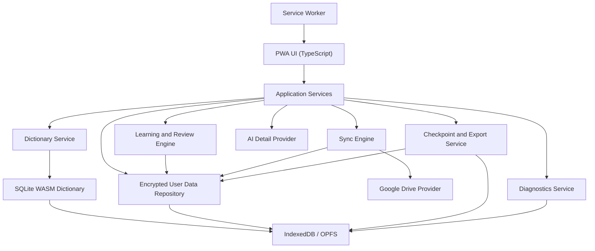

# WordLover Architecture Design

## Goals

WordLover is a local-first vocabulary and dictionary app with iPhone as the primary real-world target and Windows as the primary automation/stress-test target. Android remains a long-term supported platform, but Android-specific validation and packaging work is deliberately deferred until the end. The architecture must satisfy the PRD while keeping the core experience fast, no-fee for personal use, offline-capable, portable, debuggable, and safe for user data.

Core principles:

- Local first: dictionary, vocabulary, review, stats, and learning work offline.
- Personal use must not require app-specific fees, subscriptions, paid app-store purchases, or paid developer account fees.
- The primary install target is a Progressive Web App because it is the safest fit for long-term no-fee iPhone/iPad use.
- User data is separate from dictionary data.
- Every saved item is a `term`, meaning a word or short phrase.
- Every saved term uses a normalized term key for duplicate detection and sync.
- Every meaning preserves its source: ECDICT, WordNet, user edited, or AI assisted.
- Cloud sync is optional and stores a full encrypted copy of user data.
- AI-assisted details are optional online enhancements, never a requirement for core study.
- Platform priority for implementation and validations is: iPhone first, Windows automation fallback second, Android last.

## Platform Strategy

### Primary Stack

Use a PWA-first web architecture.

Recommended stack:

- App framework: React + TypeScript or SvelteKit + TypeScript.
- Build tool: Vite.
- PWA/offline: service worker, web app manifest, Cache Storage, IndexedDB, and Origin Private File System where available.
- Dictionary engine: SQLite compiled to WebAssembly, backed by a local browser file or IndexedDB persistence.
- User data store: encrypted IndexedDB, with a repository abstraction so a future native wrapper can swap the storage backend.
- Search acceleration: prebuilt SQLite indexes plus a compact prefix/FTS search table.
- Sync: Google Drive REST API through OAuth for the first cloud provider.
- AI details: provider abstraction with Google Gemini as the default no-additional-fee online provider through the user's Google account, plus optional ChatGPT/OpenAI integration if the user configures it.
- Packaging: iPhone Safari Home Screen PWA first; Windows browser/PWA for automation and stress testing; Android PWA/native wrapper work deferred until the end.

The PWA must be able to run from the browser and as an installed Home Screen/Desktop app. The same app shell should serve iPhone/iPad and Windows first. Android compatibility should not drive early architecture choices unless an iPhone or Windows decision would make future Android support impossible.

### Why PWA First

Native iOS apps have Apple-controlled signing and distribution constraints. A PWA installed through Safari's Add to Home Screen path avoids paid App Store distribution and paid Apple Developer Program dependency for personal long-term use. This makes PWA the preferred architecture for the stated no-fee requirement.

Native wrappers may be added later for Android or Windows convenience, but they must not become required for the core product. Android wrappers and Android-specific polish are explicitly last-priority work.

## Distribution and No-Fee Personal Install

The distribution architecture must satisfy the no-fee long-term personal-use requirement:

- iPhone/iPad: install as a Safari Home Screen web app.
- Windows: install as a PWA from Edge/Chrome; optionally provide a portable desktop wrapper later.
- Android: deferred until the end; expected path is browser-installed PWA first, optionally a no-fee sideloadable APK/TWA later.

Distribution requirements:

- The core app must not depend on App Store-only services.
- The app must not require paid Apple Developer Program membership.
- The app must not require TestFlight for long-term use.
- The app must not require a paid app-store purchase or app-specific subscription for core features.
- Local dictionary and user-data features must work in the PWA install channel.
- Sync, export/import, checkpoints, and diagnostics must not assume native app-store identity.
- Install documentation must describe the no-fee path for iPhone/iPad and Windows first. Android documentation can remain high level until Android work starts.

PWA install documentation should include:

- iPhone/iPad: open app URL in Safari, Share, Add to Home Screen, enable Open as Web App when available.
- Windows: open app URL in Edge/Chrome, Install app.
- Android, later: open app URL in Chrome/Edge, Install app or Add to Home Screen.

Installing on an additional iPhone follows the same pattern: open the trusted HTTPS app URL in Safari, install to the Home Screen, launch once online, complete local dictionary installation, then verify that search works after Wi-Fi and cellular data are disabled. The app shell, dictionary package, user database, checkpoints, and export/recovery functions must live on that iPhone after setup. Only cloud sync and AI provider calls may require internet.

Product install target: local development may require a certificate profile, but the product must not. The production path should be one user-visible step where possible and at most two: open the trusted HTTPS WordLover URL, then add/open the Home Screen app.

## Browser Capability Requirements

Because the app is PWA-first, implementation must account for browser limitations:

- All core data must be available offline after first successful install/setup.
- The service worker must cache the app shell and static assets.
- Dictionary data must be stored locally outside ordinary HTTP cache when possible, because browser cache can be evicted.
- User data must be encrypted before being stored in IndexedDB.
- The app must detect storage availability and estimate quota before downloading/importing the dictionary.
- The app must show a clear warning if the browser cannot provide enough durable storage for the dictionary.
- Export/import must provide a recovery path if browser storage is cleared.
- Cloud sync remains the main cross-device backup.

### Supported Platform Baseline

| Platform | Minimum version | Notes |
| --- | --- | --- |
| iPhone Safari / Home Screen PWA | iOS 17.0 | Required baseline for OPFS, Web Crypto, service worker, and modern PWA behavior. |
| iPad Safari / Home Screen PWA | iPadOS 17.0 | Same browser/storage baseline as iPhone. |
| Windows Edge | Edge 109+ | PWA install and OPFS support expected. |
| Windows Chrome | Chrome 109+ | Same Chromium baseline as Edge. |
| Android Chrome/Edge | Deferred | Lowest-priority validation target. Keep future compatibility in mind, but do not spend early validation or implementation cycles here. |

Browsers below the baseline should show a compatibility warning and degrade gracefully without crashing. If required storage, service worker, Web Crypto, or local dictionary capabilities are unavailable, the app should block setup of offline dictionary features and explain the limitation.

### Storage Eviction Mitigation

iOS and other browsers may evict PWA storage under storage pressure or after long periods of non-use. The app cannot fully prevent this, so it must reduce the risk and make recovery straightforward:

- Request persistent storage with `navigator.storage.persist()` where supported.
- Call `navigator.storage.estimate()` on app open and before dictionary setup.
- Warn when usage approaches quota, for example above 80%.
- Track `lastOpenedAt`, `lastSuccessfulLocalValidationAt`, and `lastSuccessfulSyncAt`.
- If the app has not been opened for a long interval, validate local user data and dictionary files on next open.
- Show a banner encouraging cloud sync or tar export when local-only data has not been backed up recently.
- Document the iOS storage risk in install/setup documentation.

Recommended storage layers:

| Data | Storage | Notes |
| --- | --- | --- |
| App shell | Service worker Cache Storage | Small, versioned, replaceable |
| Dictionary package | IndexedDB Blob or OPFS file | Read-only, rebuildable, can be re-downloaded/imported |
| Dictionary indexes | SQLite WASM database or generated search shards | Optimized for under-1-second lookup |
| User data | Encrypted IndexedDB records | Authoritative local user store |
| Checkpoints | Encrypted tar blobs in IndexedDB/OPFS | Also syncable to Google Drive |
| Logs | IndexedDB ring buffer | Redacted bundle export |
| Export files | Browser download / File System Access when available | User-controlled |

## High-Level Architecture



## Major Modules

### PWA Shell

Responsibilities:

- Installable web app manifest with icons, name, theme color, display mode, and start URL.
- Service worker for app shell caching and offline navigation fallback.
- Versioned update flow that can safely migrate user data.
- Home screen with top search input, daily stats, due-review button, and proactive new-word button.
- Dictionary result detail view.
- Vocabulary status dashboard, paged term browser, term detail, edit, archive, restore, and search/filter UI.
- Vocabulary and Today review word displays include IPA/pronunciation whenever available; missing IPA is shown explicitly so the user can notice incomplete pronunciation data.
- Review and quiz flows.
- Fast Encoding Mode.
- AI-assisted detail entry point wherever a term is displayed.
- Settings for autosave, sync, export/import, diagnostics, and privacy deletion.
- Accessibility support for large text and mobile-friendly touch targets.

UI rule:

- Treat all user-entered vocabulary items as `term`, not only `word`.
- Use responsive layouts for phone, tablet, and desktop widths.
- Avoid essential hover-only interactions because iPhone/iPad and Android are touch-first.

### Service Worker

Responsibilities:

- Cache app shell and static assets.
- Serve app offline.
- Manage app version changes.
- Avoid caching user-private export/log files in plain form.
- Never block local dictionary lookup on network.

Service worker caching strategy:

- App shell: network-first while online with explicit version and offline cache fallback.
- API/network requests: network-first where online, graceful offline fallback.
- Dictionary package: do not rely only on HTTP cache; persist through app storage after first setup.

App update UX:

- The app exposes a compact menu/settings surface that displays app version, user-data format version, dictionary data version, dictionary engine, sync status, and offline readiness.
- The user can tap **Check update** to ask the service worker to look for a newer app shell.
- If a waiting service worker is available, the user can tap **Apply update**. The app switches to the new shell only after the user chooses to apply it.
- App shell updates preserve all user data. Service-worker cache replacement may delete old shell caches only; it must not clear IndexedDB, OPFS, local storage, Google Drive data, vocabulary records, review progress, or dictionary packages.
- Dictionary package updates use a separate side-by-side install and validation flow before switching active dictionary versions.
- If update activation or dictionary validation fails, the app keeps the last-known-good app shell or dictionary package.

### Dictionary Data Pipeline

Existing local scripts generate `data/dictionary.sqlite` from ECDICT and augment missing definitions from WordNet and OPTED/Webster. For PWA delivery, add a web packaging step.

Recommended web dictionary package:

```text
dictionary/
  dictionary.sqlite.zst or dictionary.sqlite.br
  dictionary-manifest.json
  dictionary-search-prefix.bin or dictionary-search.sqlite
```

Manifest fields:

```json
{
  "dictionaryDataVersion": "2026.05.24",
  "source": ["ECDICT", "WordNet 3.0", "OPTED/Webster 1913"],
  "sqliteSha256": "...",
  "compressedBytes": 0,
  "uncompressedBytes": 0,
  "schemaVersion": "1.0",
  "createdAt": "..."
}
```

Implementation options:

1. SQLite WASM + local DB file.
   - Best fit for current dictionary pipeline.
   - Supports exact lookup, prefix lookup, frequency ordering, and source fields.
   - Needs careful browser persistence setup.

2. Sharded JSON/MessagePack search index + detail blobs.
   - Potentially faster startup and easier streaming.
   - More custom code.

Default recommendation:

- Start with SQLite WASM because the current pipeline already creates SQLite and requirements include rich structured lookup.
- Add a compact prefix index only if SQLite WASM cannot satisfy the 1-second search target on older phones.
- The 2026-05-24 Windows and real iPhone 17 Pro validations supported the SQLite WASM-first direction with the current generated SQLite dictionary. The iPhone validation was reported to start fast and load the dictionary fast.
- Prefer evaluating `wa-sqlite` with OPFS VFS during Phase 0 because it is designed for browser persistence and read-heavy SQLite workloads. Compare it against the simpler `sql.js` approach before committing to the production persistence layer.

### iPhone Memory Budget

The production iPhone target is normal-use WordLover incremental memory at or below 50 MB after dictionary installation. Browser PWAs do not expose a reliable JavaScript API for per-app DRAM on iPhone, so this must be measured with Safari Web Inspector Timelines or Xcode Instruments from a Mac when available, and inferred only roughly from Windows browser automation.

Current status:

- The current product build uses `sql.js`, which reads the full 197-206 MB SQLite file into a `Uint8Array` and opens it in WASM memory.
- This proves lookup functionality and latency, but it should be assumed to exceed the 50 MB iPhone DRAM target until measured otherwise.
- The current `sql.js` path is therefore not production-accepted for iPhone memory.

Production direction:

- Prefer `wa-sqlite` with an OPFS VFS so SQLite page cache controls memory and the full dictionary is not loaded into JS heap.
- Treat "WA/SingleNAND plus OPFS" as the product direction of WebAssembly SQLite backed by the iPhone's local storage through OPFS, with dictionary reads paged from local persistent storage instead of copied into a giant JavaScript buffer.
- The current app shell now exposes an OPFS-aware dictionary-engine status and stores dictionary packages durably, but the actual production `wa-sqlite` OPFS query engine still needs to replace the `sql.js` full-buffer runtime before the 50 MB memory requirement can be closed.
- Keep a sharded dictionary package as fallback if OPFS is unavailable or older iPhones still exceed the memory budget.
- Isolate dictionary access behind a `DictionaryRepository` interface so the UI, vocabulary, and quiz code do not depend on `sql.js`.
- Treat the memory benchmark as a blocking Phase 0/early Phase 1 gate before scaling the dictionary UI further.

Fallback dictionary package:

If SQLite WASM fails Phase 0 pass criteria, switch to a first-class sharded dictionary package:

```text
dictionary-shards/
  manifest.json
  prefix-index.bin
  shards/
    a.msgpack.br
    b.msgpack.br
    ...
```

The fallback package must support exact lookup, prefix lookup, source attribution, frequency ordering, and phrase lookup without loading the full dictionary into memory.

### Dictionary Service

Inputs:

- Raw user input.
- Local dictionary package.
- User vocabulary state, to show saved/unsaved/archived state and avoid recommending duplicates.

Responsibilities:

- Normalize terms:
  - trim leading/trailing whitespace
  - collapse repeated spaces
  - normalize apostrophe variants
  - lowercase/casefold for keys
  - allow letters, spaces, hyphens, and apostrophes
  - reject unsupported punctuation and numbers for normal study terms
- Search local dictionary within 1 second.
- Rank matches:
  1. exact normalized match
  2. prefix match
  3. phrase match
  4. fuzzy match from a narrowed candidate set
  5. frequency-ranked fallback
- Return dictionary details:
  - term
  - normalized key
  - English meanings with per-meaning source
  - Chinese meanings with per-meaning source
  - pronunciation marks
  - audio availability
  - frequency metadata
  - dictionary source metadata
  - saved/archived state for this user

Search performance tactics:

- Load dictionary engine lazily but before first user search when possible.
- Keep exact and prefix lookup indexes resident or cheaply accessible.
- Candidate-limit fuzzy search.
- Debounce typing, for example 100-200 ms, while still keeping perceived response under 1 second.
- Run heavier search work in a Web Worker so the UI stays responsive.

### User Data Repository

The user repository owns encrypted user-specific data in browser storage.

Responsibilities:

- Store exactly one vocabulary list per user for now.
- Store settings, stats, search history, review state, checkpoints, diagnostics metadata, sync metadata, and generated learning materials.
- Encrypt records before writing to IndexedDB.
- Provide migration and validation hooks.
- Provide import/export snapshots.

Recommended implementation:

- Use IndexedDB through a typed wrapper such as Dexie.
- Store encrypted JSON/CBOR records.
- Keep lightweight indexes in cleartext only when necessary for local performance and only for low-sensitivity fields. Prefer hashed normalized terms for duplicate checks.
- Use Web Crypto API for encryption.

Suggested encryption:

- AES-GCM for record/package encryption.
- Per-user data encryption key.
- Default key strategy: local generated data encryption key wrapped by a passphrase-derived key-encryption key. The raw data encryption key must not be stored in IndexedDB.
- Optional convenience strategy after Google sign-in: wrap the data encryption key and store the wrapped key in the user's Google Drive app folder.

Key hierarchy:

```text
DEK: AES-256-GCM key
  encrypts all local/cloud user data packages

Recovery KEK: passphrase-derived key
  wraps DEK in user-downloaded recovery file
  derived with PBKDF2 or Argon2id, depending on browser support and bundle size

Google KEK: account-linked wrapping key
  wraps DEK in Google Drive key-wrap file after sign-in
  optional convenience path for cross-device recovery
```

Storage locations:

```text
Wrapped DEK
  stored in IndexedDB only after AES-GCM wrapping
  unwrap requires the local passphrase or another configured key-recovery path
  known PWA limitation: browser storage is not equivalent to native secure enclave/keychain

Recovery export
  user-downloaded encrypted recovery file

Drive key-wrap
  encrypted key-wrap file in Google Drive app folder
  optional, created only after sign-in
```

New-device recovery paths:

- Import recovery file and enter passphrase.
- Or sign in with Google and retrieve the Drive key-wrap file, if previously configured.

### Vocabulary Service

Responsibilities:

- Automatically create exactly one vocabulary list per user on first save.
- Save dictionary results manually or through autosave.
- Prevent duplicate active entries by normalized term key.
- Preserve original dictionary data separately from user-edited data.
- Display user-edited values by default.
- Allow editing Chinese meaning, English meaning, and pronunciation.
- Allow archive/hide and restore.
- Exclude archived terms from normal list, review, and proactive study.
- Require at least one meaning to save unknown or incomplete terms.

Saved item rule:

- `VocabularyItem` is the user-owned object.
- `DictionaryEntry` is source data.
- User edits never mutate bundled dictionary data.

### Search and Autosave Service

Responsibilities:

- Show ten most recent valid search history items on search focus.
- Save only resolved dictionary matches to search history.
- Autosave matched dictionary searches when autosave is enabled.
- Never autosave unmatched searches.
- Never autosave duplicates.
- Respect autosave disabled setting.
- Persist autosave setting per user.

Autosave timing:

- Do not save every transient keystroke.
- Autosave timing is defined by PRD Req 33.
- Autosave only when a matched result is active, not already saved, not dismissed or replaced, and remains active for at least the dwell period specified in PRD Req 33.
- Initial dwell constant: `AUTOSAVE_DWELL_MS = 5000`. Navigating away before the dwell completes must not autosave.

### Learning and Review Engine

Responsibilities:

- Fast Encoding Mode for first-time learning.
- Quiz Mode sequence:
  - multiple choice
  - stepwise multiple choice
  - typed meaning
  - cloze sentence
  - personal sentence creation
- Review Mode using FSRS or equivalent adaptive spaced repetition.
- Difficult Word Mode for failed/repeatedly forgotten terms.
- Proactive new-word study from high-frequency dictionary words not already active or archived.
- FSRS-compatible review ratings:
  - Again
  - Hard
  - Good
  - Easy
- In normal review sessions, the app reveals the answer and then asks the user to choose Again, Hard, Good, or Easy explicitly. Debug automation may assign ratings from correctness/response time to keep repeat tests fast.
- Mastery is an app-level state derived separately from scheduler stability and user performance.

Review scheduling:

- Initial schedule supports 10 minutes, same evening, 1 day, 3 days, 7 days, 14 days, and 30 days.
- Adaptive scheduling updates from the explicit FSRS review rating, correctness, first-attempt result, response time, quiz mode, and difficult-word signals.
- Mastered terms are excluded from normal due-review lists but remain available for optional review and can re-enter review if the user later fails or manually marks the term as not mastered.
- Use a review backlog grace window for daily grouping. A term can be included in a review session when `now >= nextReviewAt - REVIEW_GRACE_WINDOW`, with an initial constant such as `REVIEW_GRACE_WINDOW_HOURS = 12`. This improves user ergonomics without changing the scheduler's stored due date.

FSRS integration:

- Recommended library: `ts-fsrs`, a TypeScript-native FSRS implementation.
- Store the serialized FSRS card object in `ReviewState`.
- Pass only FSRS-compatible ratings to the scheduler: Again, Hard, Good, Easy.
- Do not pass app mastery directly as a fake FSRS rating.
- Set `isMastered` using an app-level mastery rule, for example predicted retention at 90 days greater than 0.90 plus recent successful review history.

FSRS state mapping:

```text
ReviewState
  vocabularyItemId
  lastRating: again | hard | good | easy
  fsrsCard
    stability
    difficulty
    elapsedDays
    scheduledDays
    reps
    lapses
    state
    due
  nextReviewAt
  lastReviewedAt
  isMastered
  difficultMode
```

Proactive new-word flow:

1. Pick a frequent unsaved candidate from ECDICT frequency rank fields, excluding active and archived vocabulary items.
   - If ECDICT frequency is missing or unsuitable, fall back to the bundled high-frequency word list required by PRD Req 168.
2. Show multiple-choice quiz first.
3. If correct on first attempt, mark as already known and do not add to vocabulary.
4. If incorrect on first attempt, treat the word like a successful dictionary search and apply save/autosave rules.

Implementation notes:

- Run scheduling locally and deterministically.
- Store scheduler state as part of `ReviewState`.
- Store quiz attempts as immutable events so stats and sync are reproducible.

### Stats Service

Responsibilities:

- Calculate today's home dashboard:
  - new terms saved today
  - existing terms reviewed today
  - terms that became solidly remembered today
- Track learning/review outcomes by mode.
- Track difficult terms and mastery promotions.
- Exclude first-attempt-known proactive words from new-saved count.

Stats should be derived from immutable study events where possible, not only mutable counters. This makes sync and rollback safer.

### AI Detail Service

Responsibilities:

- Provide a button wherever a term is displayed.
- Open or use the user's connected AI provider account when available, with Gemini through Google as the default provider and ChatGPT/OpenAI as an optional provider.
- Require internet access.
- Keep local dictionary experience fully usable without AI.
- Generate/display:
  - two example sentences per distinct meaning
  - follow-up Q&A
  - quick actions for history/origin, natural usage, most frequent meaning, pronunciation tips, common mistakes, similar-word differences, and phrase usage
- Mark any saved AI content as AI assisted.

PWA implementation options:

- Default provider: Gemini through the user's Google account when available, because Google Drive sync already depends on Google sign-in and this avoids requiring a second account or paid API key for the default AI path.
- Optional provider: ChatGPT/OpenAI through a user-connected online flow or user-configured credentials.
- Provider selection must be abstracted so the UI calls `AiDetailProvider` and does not depend on one vendor.
- AI must remain optional; local dictionary and learning flows continue without any AI provider.
- Request structured JSON output from AI providers whenever possible and validate it before display or save.
- Gemini integration requires an explicitly configured Google Cloud OAuth/client setup and whatever Google API consent or quota model is available for the chosen Gemini path. The app must not imply that offline dictionary/study features depend on Gemini.
- Current implementation surface: the app loads Google Identity Services when a `googleClientId` is configured, requests Drive/profile scopes for sign-in, can upsert and restore a passphrase-encrypted AES-GCM user snapshot in Drive app data, and adds a Gemini details button to dictionary results. Gemini requests ask for structured JSON and validate it before rendering. Without a configured OAuth client ID, the UI remains local-only and explains the missing setup.

AI structured output shape:

```text
AiTermDetail
  term
  normalizedTerm
  meanings[]
    sourceMeaningId
    learnerDefinition
    exampleSentences[2]
    clozeSentences[]
    commonPhrases[]
  quickPrompts[]
    id
    label
    prompt
  provider
  generatedAt
```

Invalid, partial, or unsafe AI output should be discarded or shown as a recoverable error rather than saved silently.

AI data rule:

- AI content is supplemental.
- It must not overwrite dictionary or user-edited data unless the user explicitly copies/saves it.
- Previously generated AI content may be stored locally for offline reuse if the user saves it.

### Sync Engine

Responsibilities:

- Optional cloud sync; app remains fully usable without sign-in or internet.
- Google Drive is the first cloud provider.
- Sync full encrypted user-data copy plus metadata, not only incremental changes.
- Queue offline changes and upload later.
- Show sync status: synced, pending, failed, offline.
- Merge user data across devices.
- Never silently delete user-created content.
- Preserve user-edited meanings and pronunciation on conflict.

Cloud layout:

```text
WordLover/
  user-data-current.tar.enc
  user-data-current.manifest.json
  checkpoints/
    checkpoint-YYYYMMDD-HHMMSS.tar.enc
  diagnostics/
    log-bundle-YYYYMMDD-HHMMSS.tar.gz
```

The exact Drive folder may use app-specific storage, but the logical layout should remain provider-independent.

Sync strategy:

- Local user data is authoritative while offline.
- Each local write records an event with a monotonically increasing local sequence number.
- Sync uploads a full encrypted snapshot and a manifest after successful local validation.
- The current PWA implementation upserts one passphrase-encrypted snapshot file in Drive `appDataFolder` instead of creating duplicate files on every sync; restore downloads the latest matching file and replaces local user records after confirmation.
- Sync downloads cloud manifest first, compares versions and device clocks, then merges or prompts when needed.
- After sync merge, validate integrity and create/update checkpoint.

Two-tier sync plan:

- Tier 1, Phase 4 baseline: full encrypted snapshot sync. This is simple and acceptable while the user-data snapshot is small, for example under about 5 MB.
- Tier 2, future extension: append-only encrypted event-log sync. Download only events since the last `syncVersion`, merge locally, and periodically compact into a full snapshot.
- The data model must keep immutable study events separate from mutable vocabulary state and include `syncVersion` on every event so Tier 2 can be added without redesigning the store.
- Treat the full snapshot as a compaction of the event log, not as the only possible sync format.

PWA OAuth notes:

- Use browser-based OAuth flow with PKCE.
- On first install, prompt the user to sign in with Google after the local shell is ready. The prompt must allow Skip for offline-only use.
- Request the minimum scopes needed for Drive sync first; request AI-related scopes only when the user opens an AI feature if separate consent is needed.
- Store refresh/session material only according to Google OAuth rules and browser security limits.
- Never log tokens.
- Sync must tolerate token expiry and prompt re-authentication.
- The OAuth implementation must support installing WordLover on a second iPhone: sign in, retrieve the encrypted Drive snapshot and optional Drive key-wrap, restore local user data, then continue with local-first operation.

### User Data Versioning

Every local, cloud, checkpoint, export, and import package contains:

- `appVersion`
- `dataFormatVersion`
- `dictionaryDataVersion`
- `createdAt`
- `updatedAt`
- `userAccountId`
- `deviceId`
- `syncVersion`
- integrity hashes

Rules:

- Older data format: create checkpoint, run migration, validate.
- Newer unsupported data format: do not write or downgrade; warn user and allow safe recovery/read-only options where possible.
- App version and data format version are separate fields even when their values match, such as app `1.5` and data format `1.5`.

### Backup, Checkpoint, Export, Import

Responsibilities:

- Daily local checkpoint.
- Checkpoint before sync merge, migration, import, rollback, bulk import, or other high-risk operation.
- Roll back to known-good checkpoint.
- Create final checkpoint before rollback.
- Revalidate after restore.
- Retain multiple checkpoints with storage-aware pruning.

Export:

- User-triggered export creates a compressed tar archive of user-specific data.
- Normal export excludes bundled dictionary.
- Export includes version and integrity metadata.
- Export can be imported into another installation or different user account with explicit confirmation.
- In PWA, export uses browser download; File System Access API may be used on browsers that support it.

Import:

- Validate tar structure, version metadata, and hashes.
- Create checkpoint before import.
- Offer replace or merge when current data already exists.
- Revalidate after import.

Tar format:

```text
wordlover-user-data.tar
  manifest.json
  user-data.json.enc or user-data.cbor.enc
  checkpoints/
  logs/
  hashes.json
```

### Diagnostics Service

Responsibilities:

- Structured local logs for crashes, sync failures, lookup failures, corruption warnings, review problems, and unexpected data changes.
- Privacy-conscious logging by default.
- Redaction mode for logs, diagnostic bundles, and export bundles.
- User-triggered compressed diagnostic bundle generation.
- Bundle includes logs, app/browser/device version, schema versions, sync metadata, recent errors, and checkpoint metadata.
- Primary sharing path uses browser download and the Web Share API where available.
- Advanced optional sharing path may upload to a configured Git repository through a Git hosting REST API.
- Offline upload retry.

Logging rule:

- Prefer IDs, counts, timestamps, state names, error codes, schema versions, and hashes.
- Avoid raw vocabulary meanings and private user-entered text unless the user explicitly chooses an unredacted support bundle.

PWA diagnostics should include:

- User agent.
- PWA display mode.
- Service worker version.
- Cache version.
- Storage estimate/quota when available.
- Dictionary data version.
- User-data format version.

Diagnostic sharing:

- Primary: `navigator.share({ files: [...] })` when available, otherwise browser download.
- Advanced optional: GitHub/GitLab REST API upload using user-provided token and repository/path settings.
- A PWA cannot run `git push`; any Git integration must use HTTPS APIs and must never log tokens.

## Data Architecture

### Dictionary Database

Bundled/downloaded read-only SQLite package.

Primary tables:

- `dictionary_entries`
- `toefl_entries` view
- `dictionary_search_fts` or equivalent search table
- `metadata`

This database can be replaced during app or dictionary data updates. It is never modified by user edits.

PWA-specific handling:

- The app should verify the dictionary package hash before use.
- Dictionary initialization should be resumable if interrupted.
- Dictionary updates should install side-by-side, validate, then switch active version.
- Keep a last-known-good dictionary package when storage allows.

### User Database

Encrypted IndexedDB-backed repository.

Core entities:

```text
UserProfile
UserSettings
VocabularyList
VocabularyItem
Meaning
Pronunciation
SearchHistoryItem
StudyEvent
ReviewState
QuizAttempt
GeneratedLearningMaterial
ArchiveRecord
DictionaryReport
SyncState
CheckpointManifest
DiagnosticLogIndex
```

Important fields:

```text
VocabularyItem
  id
  userId
  term
  normalizedTerm
  normalizedTermHash
  status: active | archived | deleted
  savedAt
  archivedAt
  sourceDictionaryEntryId
  originalDataSnapshotId
  userEditedDataId
  reviewStateId
  createdDeviceId
  updatedAt
  syncVersion

Meaning
  id
  vocabularyItemId
  language: en | zh
  text
  source: ECDICT | WordNet | user_edited | AI_assisted
  sourceRef
  displayOrder
  userRank
  createdAt

ReviewState
  vocabularyItemId
  lastRating: again | hard | good | easy
  fsrsCard
  nextReviewAt
  lastReviewedAt
  isMastered
  difficultMode
```

Meaning ordering:

- `displayOrder` is the default integer order, lower values display first.
- `userRank` is nullable and is set only when the user explicitly reorders meanings.
- Display order is `ORDER BY COALESCE(userRank, displayOrder) ASC`.
- Default source priority:
  1. user-edited meanings
  2. ECDICT meanings in source/frequency order
  3. WordNet meanings
  4. AI-assisted meanings

### Study Event Retention Policy

Study events are immutable so stats, sync, and rollback can be reproduced. To keep the active store small:

- Keep all study events for the current and previous calendar year as active records.
- Archive older events into compressed yearly summary blobs, such as `study-events-2026.cbor.br`.
- Include summary blobs in cloud sync and user-data export.
- Active records drive current stats, scheduling, and sync.
- Summary blobs are used for historical stats views.
- Approximate size budget: 200-400 bytes per active event. A user reviewing 10 terms per day creates about 3,650 events/year, which is manageable if older years are compacted.

## Security and Privacy

Security requirements:

- Encrypt local user data before writing to browser storage.
- Encrypt cloud user-data archives.
- Store OAuth tokens according to browser security best practices.
- Support deletion of all local user data.
- Support deletion of cloud app data when authorized.
- Redact logs and bundles by default.

Key management:

- Generate a per-user data encryption key or derive one from user-controlled credentials.
- Wrap/export keys only through explicit recovery/sync flows.
- For cloud backup/sync, encrypt package contents before upload.
- Never store access tokens in logs or diagnostic bundles.

PWA caveat:

- Browser apps do not have the same secure enclave/keychain access as native apps. Therefore, the final implementation must choose a clear key recovery model and document the tradeoff between convenience and security.

## Performance Targets

Required:

- App startup to visible usable search input: under 1 second on supported devices after the PWA has been installed and initialized.
- Normal local dictionary search response: under 1 second.
- iPhone normal-use incremental memory: <= 50 MB after dictionary installation where measurable. The dictionary engine must avoid a persistent full-dictionary JS/WASM heap allocation.

Design tactics:

- Show home shell before loading optional network services.
- Lazy-load AI, sync, export/import, and diagnostics modules.
- Initialize dictionary search in a Web Worker.
- Use page-cache or shard-based dictionary reads instead of loading the complete dictionary file into memory.
- Keep exact/prefix search indexes compact.
- Avoid network calls in core search path.
- Cache today's stats and invalidate from study events.
- Keep encrypted user data repository separate from dictionary package.
- Run compression, encryption, import/export, and sync packaging in Web Workers where possible.

## Themes And Debug Test Mode

The app supports at least three local themes:

- Calm teal.
- Ink focus.
- Sunrise.

Theme selection is stored in encrypted local user settings and should later sync as part of user settings.

Debug review mode:

- Lives under diagnostics, not in the primary study UI.
- Speeds review time so one day elapses every 20 seconds.
- Tags debug-created vocabulary, history, and study events with a debug session ID.
- On disable, purges records from that debug session so test data does not pollute real study progress.

## Offline Behavior

Works offline:

- Launch installed PWA after initial setup.
- Search local dictionary.
- Save/edit/archive vocabulary.
- Review due items.
- Fast Encoding Mode using local/pre-generated content.
- Proactive new-word study from local frequency data.
- Stats.
- Checkpoints and rollback.
- Export local user tar.
- Generate local diagnostic bundle.

Requires internet:

- First-time app load before install, unless hosted on local network.
- First-time dictionary package download if not already installed/imported.
- Google sign-in and sync.
- Cloud deletion.
- Advanced diagnostic upload to Git repo, if enabled.
- AI-assisted online details through Gemini, ChatGPT/OpenAI, or another configured provider.

## Phase 0 Validation Criteria

Phase 0 must produce a written validation report before Phase 1 begins.

| Criterion | Pass threshold | Required device/browser |
| --- | --- | --- |
| Cold dictionary search latency | <= 1 second | iPhone 12 or comparable device, iOS 17 Safari |
| App shell visible on launch | <= 1 second | iPhone 12 or comparable device, iOS 17 Safari |
| OPFS or IndexedDB persistence | Data survives app close and reopen | iPhone Safari Home Screen PWA |
| Storage quota available | >= 400 MB grantable or documented alternative package size | iPhone Safari |
| Dictionary memory behavior | Normal-use app memory stays <= 50 MB where measurable; otherwise no full-dictionary JS/WASM heap load is allowed | iPhone Safari, measured with Safari Web Inspector or Xcode Instruments when available |
| Offline launch | Installed app opens while offline after setup | iPhone Safari Home Screen PWA |
| Export/import tar | User-data tar export and import works | iPhone Safari and Windows browser |

If SQLite WASM fails any critical dictionary latency, persistence, or memory criterion, activate the sharded dictionary fallback before Phase 1 local core work continues.

Current validation snapshot:

| Validation | Result | Notes |
| --- | --- | --- |
| Windows PWA dictionary validation | Pass | App shell, service worker, SQLite fetch/open, exact word lookup, phrase lookup, invalid input rejection, IndexedDB history persistence, and export-button flow were validated. Exact observed lookup times were far below 1 second. |
| Real iPhone 17 Pro PWA validation | Pass, with one remaining manual offline confirmation | User reported the web app starts fast and loads the dictionary fast while online. Automated iPhone reports later verified service worker readiness, IndexedDB persistence, OPFS persistence, encrypted export/import, mock sync, and lookup p95 far under 1 second after open. First full dictionary network fetch was about 7.5-7.8 seconds for 206 MB. |
| Phase 0 automated browser test suite | Pass on Windows and iPhone Safari | IndexedDB dictionary persistence, OPFS dictionary persistence, offline shell cache readiness, encrypted export/import, mock Google Drive-style sync, and 100 lookup timing benchmark passed. Android is intentionally deferred. Real Google OAuth remains account-gated. |
| Offline dictionary fallback validation | Pass on Windows fallback automation; partial iPhone pass | Main validation now saves the dictionary to IndexedDB after an online load. With the server stopped, the app shell reloaded, the dictionary opened from `indexedDB offline copy`, and phrase search worked. iPhone automated suite confirms IndexedDB persistence; true Wi-Fi-off Home Screen search still needs manual final confirmation. |
| Chinese/fuzzy dictionary smoke | Pass on Windows fallback automation | `放弃` returns English candidates and `abanden` suggests `abandon`. Production should move this logic into FTS/trigram indexes rather than relying only on JavaScript candidates. |
| App version/update menu validation | Implemented in current PWA | The compact app menu shows app version, user-data format version, dictionary engine, sync state, memory-target note, export state, and service-worker update controls. Real iPhone update activation still needs manual confirmation. |
| iPhone DRAM target | Not yet passed | Current `sql.js` validation should be assumed above the <= 50 MB target because it loads the full dictionary into JS/WASM memory. Dedicated `wa-sqlite`+OPFS or sharded dictionary memory validation is required. |

Validation report contents:

- Device models and OS/browser versions tested.
- SQLite WASM library version and persistence mode.
- Startup and search latency, including median and p95 over at least 20 runs.
- Peak and steady-state memory during dictionary install, open, lookup, background, and relaunch.
- Storage quota available and granted.
- Offline launch result.
- Export/import result.
- Encryption key recovery model decision.
- Pass/fail verdict and rationale.

## Requirement Traceability

| Area | PRD IDs |
| --- | --- |
| Term input and dictionary lookup | 1-10, 27-31, 136-139 |
| Vocabulary list and editing | 11-12, 18-25, 140-142 |
| Search history and autosave | 32-42 |
| Home screen and stats | 43-47, 58, 133 |
| Review and proactive study | 48-59, 113-135, 147-148 |
| Platform, local-first, offline, and no-fee personal install | 60-64, 67, 135, 157-159, 171-172, 180 |
| Sync and cloud storage | 65-69, 98-103, 145-146, 175-176 |
| AI-assisted details | 70-79, 134, 177 |
| Diagnostics | 80-86 |
| Backup, rollback, export, import | 87-97, 104-112 |
| Security and privacy | 149-154 |
| Accessibility | 155-156 |
| Performance | 143-144, 173-174 |
| Setup, dictionary update, compatibility, and Phase 0 validation | 160-168, 178-181 |
| Theme, compact UI, diagnostics debug mode, and test automation | 182-186 |
| Review grace and AI structured output | 169-170 |

## Implementation Phases

Detailed phase execution lives in `docs/development-plan.md`. The architecture phases below remain the high-level technical map.

### Phase 0: Technical Validation

- Validate SQLite WASM on iPhone Safari with the generated dictionary package. Status: passed for iPhone 17 Pro functionality/latency feasibility with `sql.js`, but not accepted for the <= 50 MB DRAM target.
- Compare `wa-sqlite` OPFS VFS against any simpler SQLite WASM option. Status: OPFS and IndexedDB package persistence passed with `sql.js` on Windows and iPhone Safari; `wa-sqlite` still needs a dedicated benchmark before final production decision because `sql.js` keeps the full dictionary in memory.
- Measure iPhone memory during dictionary install/open/search/background/relaunch. Status: not yet measured; this is a blocking production-engine criterion.
- Measure startup and lookup time on iPhone and Windows. Status: Windows measured; iPhone automated report measured lookup p95 far below 1 second after dictionary open. First full dictionary network fetch is still too large for production UX. Android timing is deferred until the end.
- Validate storage quota and persistence behavior. Status: IndexedDB and OPFS passed on Windows browser and iPhone Safari automated suite. Android persistence is deferred.
- Validate Add to Home Screen install flow. Status: iPhone PWA path validated at feasibility level; document exact iOS version in timed pass.
- Validate offline launch after install. Status: Windows service-worker shell reload passed with the local server stopped; original iPhone test showed shell launch works but dictionary load/search fail until offline dictionary persistence is installed and retested.
- Validate manual app update flow on iPhone. Status: PWA menu now exposes version and service-worker update controls; real iPhone update application still needs confirmation.
- Validate export/import tar in browser. Status: encrypted tar-style export/import round trip passed in the automated browser validation; full product UI export/import still needs implementation.
- Produce the Phase 0 validation report required by PRD Req 167.
- Confirm or reject SQLite WASM. Current direction: continue with SQLite WASM first for iPhone and Windows; keep sharded package as fallback only if iPhone persistence, memory, or timed latency fails. Android must not block this decision.

### Phase 1: PWA Local Core

- TypeScript PWA shell.
- Service worker and manifest.
- Dictionary package installation and hash validation.
- Term normalization, exact/prefix search, dictionary details.
- iPhone-first dictionary UI with search as the primary first-screen action.
- URL-driven search smoke tests for iPhone automation, such as `/?q=take%20off&report=1`.
- Chinese-to-English lookup, fuzzy suggestion fallback, and phrase-friendly suggestions.
- Encrypted user record storage and persistent IndexedDB connection before saving vocabulary items.
- Resumable dictionary installer checkpoints for interrupted first install.
- Encrypted user data repository.
- Vocabulary save/edit/archive.
- Autosave and search history.
- Home stats.
- No-fee install documentation for iPhone/iPad and Windows. Android documentation is deferred until the end.

### Phase 2: Learning Engine

- Fast Encoding Mode.
- Quiz modes.
- FSRS/adaptive scheduler.
- FSRS ratings: Again, Hard, Good, Easy.
- App-level mastery state.
- Due-review flow.
- Proactive new-word flow.

### Phase 3: Safety and Portability

- Checkpoints and rollback.
- Export/import tar.
- Diagnostics and redaction.
- Performance hardening.
- Accessibility pass.

### Phase 4: Cloud Sync

- Google OAuth PKCE.
- Google Drive provider.
- Full encrypted cloud copy.
- Sync status UI.
- Conflict handling.
- Cloud delete.

### Phase 5: AI Assistance

- AI-provider-connected detail view, with Gemini as the default no-additional-fee provider and ChatGPT/OpenAI as optional.
- Example sentence generation/display.
- Follow-up quick actions.
- Save AI content with source attribution.

### Phase 6: Optional Native Wrappers And Deferred Android

- Windows wrapper if a desktop installer is useful.
- iOS native wrapper only if Apple signing/distribution constraints become acceptable.
- Android PWA validation, Android-specific UI polish, and Android TWA/APK packaging. This is the lowest-priority platform work and should happen after the iPhone and Windows paths are stable.

## Open Decisions

- Exact SQLite WASM production persistence mode. The automated Windows validation shows that IndexedDB can persist the dictionary package with `sql.js`, and OPFS is available on Windows. Production still needs iPhone numbers before choosing the final storage path. Android numbers are deferred.
- Exact dictionary packaging format and compression for first-time setup and updates.
- Whether user-data export is encrypted by default or offers encrypted and plain tar modes.
- Whether fuzzy search should support numbers later for terms like `360-degree feedback`.
- Whether advanced Git diagnostic upload is worth implementing after Web Share/browser download.
- Whether optional native wrappers are worth maintaining after the PWA is stable.

## Architecture Decision Records

### ADR-001 - PWA Over Native iOS App

Date: 2026-05-24

Status: Accepted

Context: Long-term personal iPhone/iPad use must not require paid Apple Developer Program membership, TestFlight, or App Store purchase.

Decision: Use a PWA installed through Safari Add to Home Screen as the primary install target.

Alternatives considered: Flutter native, React Native, Capacitor native wrapper.

Consequences: No Apple signing fee for the primary path, but browser storage and iOS PWA limitations must be managed explicitly.

### ADR-002 - SQLite WASM First With Sharded Dictionary Fallback

Date: 2026-05-24

Status: Accepted for Phase 1 direction, with persistence validation still required

Context: The existing dictionary pipeline already produces SQLite. Windows and real iPhone 17 Pro validations showed that the current SQLite dictionary can support fast PWA startup and dictionary loading in the feasibility prototype. The automated Windows validation also validated IndexedDB and OPFS package persistence. Durable mobile browser persistence, older-device behavior, and the <= 50 MB iPhone DRAM target still need validation.

Decision: Continue with a SQLite-shaped dictionary interface as the first implementation path. The current `sql.js` implementation remains a temporary compatibility fallback only because it loads the full dictionary into memory. Evaluate the production persistence layer, preferably `wa-sqlite` with OPFS or IndexedDB VFS compared with a sharded dictionary package. If persistence, older-device memory, or timed latency fails, switch to the sharded package.

Consequences: Phase 1 can proceed with SQLite-shaped dictionary interfaces, but Phase 0 must still finish iPhone persistence, iPhone offline dictionary search, iPhone timed benchmarks, iPhone memory measurement, and real Google OAuth validation before the architecture is considered fully proven. Android validation is intentionally deferred and should not block iPhone/Windows progress.

### ADR-003 - Local Generated Key With Recovery Export

Date: 2026-05-24

Status: Accepted for initial design

Context: The app is PWA-first and cannot rely on native secure enclave/keychain. It must support offline local use and cross-device recovery.

Decision: Generate a local DEK, prompt the user to export a passphrase-protected recovery file, and optionally wrap the DEK to Google Drive after sign-in.

Consequences: Users get a no-Google recovery path and a convenient Google recovery path, but documentation must explain browser key-storage limits.
